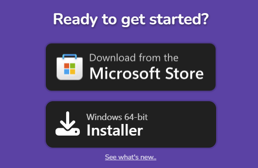
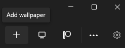
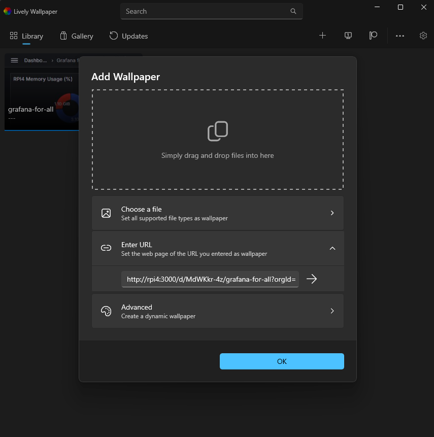
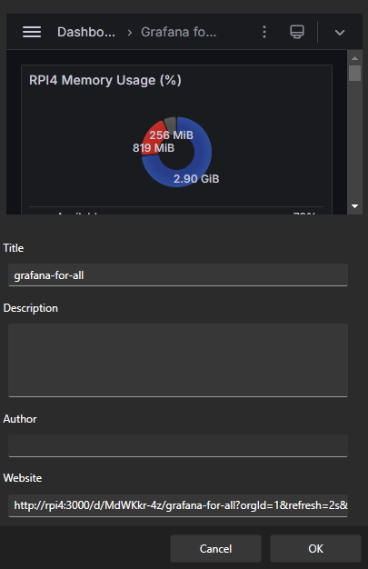
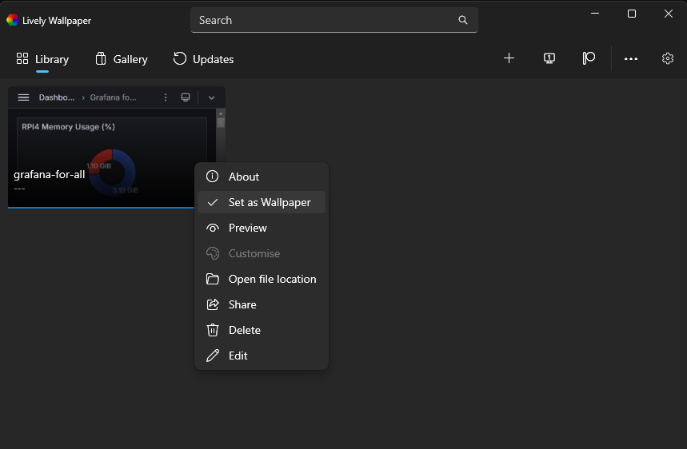

# Grafana Wallpaper

This repository provides a step-by-step guide for setting up Grafana and displaying dashboards as your desktop wallpaper using Lively Wallpaper.

## 1.0 Installing Lively Wallpaper

1.1 Download and install Lively Wallpaper for Windows from the [official website](https://www.rocksdanister.com/lively).

<p align="center">
  
</p>

## 2.0 Configuring Grafana

2.1 Before adding the Grafana dashboard to Lively Wallpaper, you need to adjust two settings in the `defaults.ini` file located at:

    C:\Program Files\GrafanaLabs\grafana\conf\defaults.ini

2.2 Open the `defaults.ini` file and locate the `[auth.anonymous]` section. Make the following changes:
 
```ini
[auth.anonymous]
# enable anonymous access
enabled = true

# specify organization name that should be used for unauthenticated users
org_name = Main Org.
```

Be sure to save the file as an administrator, or use Notepad with administrator privileges.

Save the file with administrator privileges, or use Notepad run as administrator. This configuration allows access to your dashboard without logging in, ensuring you don't need to log in each time the computer reboots.

2.3 After saving the changes, restart the Grafana service or reboot the computer where Grafana is installed.

## 3.0 Setting Up Lively Wallpaper

3.1 Open Lively Wallpaper and click on "Add New Wallpaper."

<p align="center">
  
</p>

3.2 In the URL field, enter the URL of the Grafana dashboard you want to display:

Example: `http://localhost:3000/d/MdWKkr-4z/grafana-for-all?orgId=1`

<p align="center">
  
</p>

3.3 Append the desired refresh rate to the URL:

`&refresh=5s`

3.4 For fullscreen mode, add:

`&kiosk=tv`

3.5 Your final URL should look something like this:

`http://localhost:3000/d/MdWKkr-4z/grafana-for-all?orgId=1&refresh=5s&kiosk=tv`

3.6 Click the right arrow to proceed, then click "OK."

<p align="center">
  
</p>

3.7 Click on the three dots of the created wallpaper and select "Set as Wallpaper." Your Grafana dashboard will now be displayed on your desktop.

<p align="center">
  
</p>

## Example photo:

<p align="center">
  
</p>

3.8  To show the sidebar as in the example photo, go to the Grafana sidebar menu and select "Dock Menu." This will keep the sidebar visible on your wallpaper, allowing you to organize your files and folders clearly on your desktop.

<p align="center">
  
</p>

3.9 It is also recommended to enable "Start with Windows" and "System-Tray Icon" in Lively Wallpaper settings to ensure the wallpaper and application start automatically and function properly.


And that's it! Your Grafana dashboard should now be set as your desktop wallpaper.


